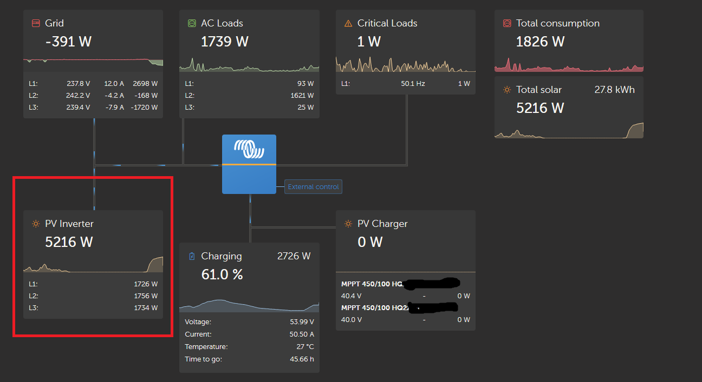
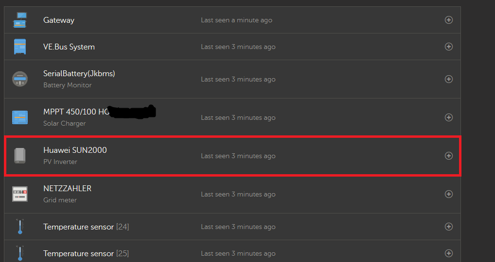

# dbus-huaweisun2000-pvinverter

D-Bus driver for Victron Cerbo GX / Venus OS for Huawei SUN 2000 inverters

## Purpose

This script is intended to help integrate a Huawei SUN 2000 inverter into the Venus OS and thus also into the VRM
portal.

I use a Cerbo GX, which I have integrated via Ethernet in the house network. I used the WiFi of the device to connect to
the internal WiFi of the Huawei Sun 2000. Note: No extra dongle is necessary! You can use the integrated Wifi,
which is actually intended for configuration with the Huawei app (Fusion App or Sun2000 App). The advantage is that no
additional hardware needs to be purchased and the inverter does not need to be connected to the Internet.

To further use the data, the mqtt broker from Venus OS can be used.

## Todo

- [ ] better logging
- [ ] enable read out of connected grid meters
- [ ] allow override of GUI settings via config file
- [x] find out why the most values are missing in the view
- [x] repair modelname (custom name in config)
- [x] possibility to change settings via gui
- [ ] alarm, state
- [ ] more values: temperature, efficiency
- [ ] clean code

Cooming soon

## Installation / Upgrade

1. Download the latest release and extract it into the /data/ folder on your Venus OS:

    - /data/dbus-huaweisun2000-pvinverter/

   Info: The /data directory persists data on Venus OS devices even when updating the firmware

   Easy way to do this:
   ```
   rm -f project.zip
   wget https://github.com/kcbam/dbus-huaweisun2000-pvinverter/releases/latest/download/project.zip
   mkdir -p /data/dbus-huaweisun2000-pvinverter
   unzip -o project.zip -d /data/dbus-huaweisun2000-pvinverter
   chmod a+x /data/dbus-huaweisun2000-pvinverter/install.sh
   rm project.zip
   ```
2. Run install.sh

   `/data/dbus-huaweisun2000-pvinverter/install.sh`

3. Edit the settings in the *V1* Remote Console under 'Settings -> PV inverters -> Huawei SUN2000'

4. Restart the driver

   `sh /data/dbus-huaweisun2000-pvinverter/restart.sh`

5. Optional if it doesn't work: check Modbus TCP Connection to the inverter

   `python /data/dbus-huaweisun2000-pvinverter/connector_modbus.py`

### Debugging

You can check the status of the service with svstat:

`svstat /service/dbus-huaweisun2000-pvinverter`

It will show something like this:

`/service/dbus-huaweisun2000-pvinverter: up (pid 10078) 325 seconds`

If the number of seconds is always 0 or 1 or any other small number, it means that the service crashes and gets
restarted all the time.

When you think that the script crashes, start it directly from the command line:

`python /data/dbus-huaweisun2000-pvinverter/dbus-huaweisun2000-pvinverter.py`

Also useful:

`tail -f /var/log/dbus-huaweisun2000/current | tai64nlocal`

### Stop the script

`svc -d /service/dbus-huaweisun2000-pvinverter`

### Start the script

`svc -u /service/dbus-huaweisun2000-pvinverter`


### Restart the script

If you want to restart the script, for example after changing it, just run the following command:

`sh /data/dbus-huaweisun2000-pvinverter/restart.sh`

## Uninstall the script

Run

   ```
sh /data/dbus-huaweisun2000-pvinverter/uninstall.sh
rm -r /data/dbus-huaweisun2000-pvinverter/
   ```

# Examples






# Thank you
## Contributers

DenkBrettl
ricpax (Energy meter code)

## Used libraries

modified verion of https://github.com/olivergregorius/sun2000_modbus

## this project is inspired by

https://github.com/RalfZim/venus.dbus-fronius-smartmeter

https://github.com/fabian-lauer/dbus-shelly-3em-smartmeter.git

https://github.com/victronenergy/velib_python.git
